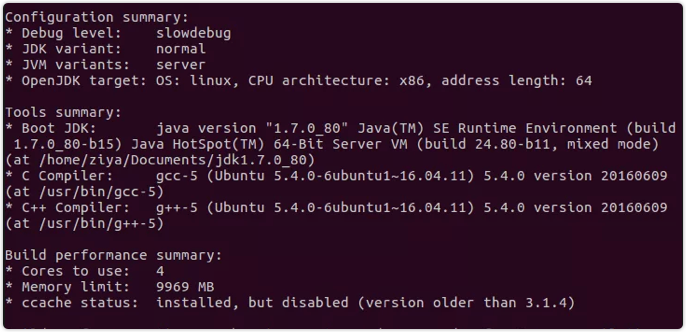
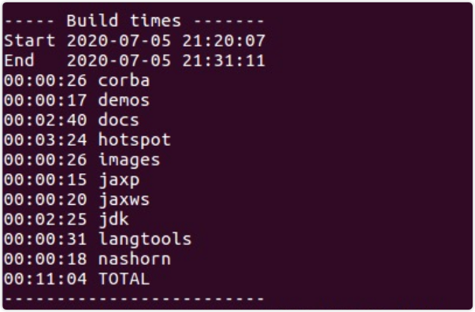

# hotspot 调试环境搭建

## openjdk 编译步骤
### 以jdk1.8为例
1. 安装Ubuntu环境(我这里使用20.04版本，不过版本最好高于16+以上，x86_64环境)
2. 使用终端更新依赖
> `sudo apt upgrade & sudo apt update`
> 如果是低版本的系统，只要把命令更换为 `sudo apt-get upgrade & sudo apt-get update`
3. 更新完毕之后安装必要的依赖库
> `sudo apt install libx11-dev libxext-dev libxrender-dev libxtst-dev libxt-dev libcups2-dev libfreetype6-dev libasound2-dev ccache`

> `apt` 命令同理
4. 安装 `git` (推荐) 或者 `hg` 工具用于克隆代码(二选其一即可)
> sudo apt install git / sudo apt install
> 
安装 `mercurial` (也就是hg命令，同上，二选其一即可)
```shell
sudo add-apt-repository -y ppa:mercurial-ppa/releases
sudo apt update
sudo apt install -y python-pip python-dev
sudo pip install mercurial --upgrade
```
> git 仓库地址: `https://github.com/openjdk/jdk/tree/jdk8-b120`

> hg 仓库地址: `http://hg.openjdk.java.net/jdk8u/jdk8u/`
5. 克隆 `openjdk` 源码
如果是git用户, 使用 `git clone -b jdk8-b120 git@github.com:openjdk/jdk.git` 命令克隆(推荐)

如果是hg用户则使用 `hg clone http://hg.openjdk.java.net/jdk8u/jdk8u/` </br>
即可以下载到openjdk的源码.
下载完成之后cd 到对应目录中
6. 给 `configure` 脚本增加执行权限
> chmod u+x ./configure

7. 下载bootJDK.
> 使用Oracle的jdk7或者openjdk皆可, 我这里选择Oracle的jdk</br>
> jdk下载地址: [下载链接](http://jdk.java.net/java-se-ri/7)

8. 配置 `bootJDK` 环境变量(将 `{base_path}` 替换成你自己的路径即可)

`sudo vim /etc/profile` # 将配置追加到你的profile文件末尾。使用 `G` 命令在vim的命令模式下快速跳转到文件末尾。然后使用 `O` 插入
```shell
export JAVA_HOME={base_path}/jdk1.7.0_80
export CLASSPATH=.:$JAVA_HOME/lib/dt.jar:$JAVA_HOME/lib/tools.jar
export PATH=$JAVA_HOME/bin:$ANT_HOME/bin:$PATH
```
然后使用 `:wq` 保存, 使用 `source` 命令使配置生效 `source /etc/profile`

9. 准备编译openJDK环境</br>
> `./configure --with-target-bits=64 --with-boot-jdk={base_path}/jdk1.7.0_80 --with-debug-level=slowdebug --enable-debug-symbols ZIP_DEBUGINFO_FILES=0`</br>

附录中会贴出 `configure` 命令所支持的参数。现在可以先这么用</br>
如果出现如下提示则配置成功


10. 开始编译openJDK</br>
> `make all DISABLE_HOTSPOT_OS_VERSION_CHECK=OK ZIP_DEBUGINFO_FILES=0` </br>
如果出现如下提示则编译成功


11. 编译中可能出现的一些问题
    1. 报错信息1(这是我编译时候遇到最多的问题。后续有问题可以提issue. 我这边更新到文档中)
    ```c++ 
    make[6]: *** [/home/autorun/platform/source/jdk/hotspot/make/linux/makefiles/vm.make:297: precompiled.hpp.gch] Error 1
    make[5]: *** [/home/autorun/platform/source/jdk/hotspot/make/linux/makefiles/top.make:119: the_vm] Error 2
    make[4]: *** [/home/autorun/platform/source/jdk/hotspot/make/linux/Makefile:289: product] Error 2
    make[3]: *** [Makefile:217: generic_build2] Error 2
    make[2]: *** [Makefile:167: product] Error 2
    make[1]: *** [HotspotWrapper.gmk:45: /home/autorun/platform/source/jdk/build/linux-x86_64-normal-server-release/hotspot/_hotspot.timestamp] Error 2
    make: *** [/home/autorun/platform/source/jdk//make/Main.gmk:109: hotspot-only] Error 2
    ``` 
        解决方案: 降低g++和gcc版本即可。
    ```shell
    sudo apt install -y gcc-4.8
    sudo apt install -y g++-4.8
    # 重新建立软连接
    cd /usr/bin             #进入/usr/bin文件夹下
    sudo rm -r gcc          #移除之前的软连接
    sudo ln -sf gcc-4.8 gcc #建立gcc4.8的软连接
    sudo rm -r g++
    sudo ln -sf g++-4.8 g++
    ```

12. 关于 `configure` 脚本和 `make` 的说明

|OpenJDK Configure Option | Description |
|:----:|:----:|
| --enable-debug | set the debug level to fastdebug (this is a shorthand for --with-debug-level=fastdebug) |
| --with-alsa=path |  select the location of the Advanced Linux Sound Architecture (ALSA)Version 0.9.1 or newer of the ALSA files are required for building the OpenJDK on Linux. These Linux files are usually available from an "alsa" of "libasound" development package, and it's highly recommended that you try and use the package provided by the particular version of Linux that you are using.|
| --with-boot-jdk=path | select the Bootstrap JDK |
| --with-boot-jdk-jvmargs="args" | provide the JVM options to be used to run the Bootstrap JDK |
| --with-cacerts=path | select the path to the cacerts file. See http://en.wikipedia.org/wiki/Certificate_Authority for a better understanding of the Certificate Authority (CA). A certificates file named "cacerts" represents a system-wide keystore with CA certificates. In JDK and JRE binary bundles, the "cacerts" file contains root CA certificates from several public CAs (e.g., VeriSign, Thawte, and Baltimore). The source contain a cacerts file without CA root certificates. Formal JDK builders will need to secure permission from each public CA and include the certificates into their own custom cacerts file. Failure to provide a populated cacerts file will result in verification errors of a certificate chain during runtime. By default an empty cacerts file is provided and that should be fine for most JDK developers.|
| --with-cups=path | select the CUPS install location The Common UNIX Printing System (CUPS) Headers are required for building the OpenJDK on Solaris and Linux. The Solaris header files can be obtained by installing the package SFWcups from the Solaris Software Companion CD/DVD, these often will be installed into the directory /opt/sfw/cups.  The CUPS header files can always be downloaded from www.cups.org.|
| --with-cups-include=path | select the CUPS include directory location|
| --with-debug-level=level | select the debug information level of release, fastdebug, or slowdebug |
| --with-dev-kit=path | select location of the compiler install or developer install location |
| --with-freetype=path | select the freetype files to use.Expecting the freetype libraries under lib/ and the headers under include/. Version 2.3 or newer of FreeType is required. On Unix systems required files can be available as part of your distribution (while you still may need to upgrade them). Note that you need development version of package that includes both the FreeType library and header files. You can always download latest FreeType version from the FreeType website. Building the freetype 2 libraries from scratch is also possible, however on Windows refer to the Windows FreeType DLL build instructions. Note that by default FreeType is built with byte code hinting support disabled due to licensing restrictions. In this case, text appearance and metrics are expected to differ from Sun's official JDK build. See the SourceForge FreeType2 Home Page for more information. |
|--with-import-hotspot=path | select the location to find hotspot binaries from a previous build to avoid building hotspot |
| --with-target-bits=arg | select 32 or 64 bit build |
| --with-jvm-variants=variants | select the JVM variants to build from, comma separated list that can include: server, client, kernel, zero and zeroshark |
| --with-memory-size=size | select the RAM size that GNU make will think this system has |
| --with-msvcr-dll=path | select the msvcr100.dll file to include in the Windows builds (C/C++ runtime library for Visual Studio).This is usually picked up automatically from the redist directories of Visual Studio 2010.|
| --with-num-cores=cores | select the number of cores to use (processor count or CPU count) |
| --with-x=path	| select the location of the X11 and xrender files.The XRender Extension Headers are required for building the OpenJDK on Solaris and Linux. The Linux header files are usually available from a "Xrender" development package, it's recommended that you try and use the package provided by the particular distribution of Linux that you are using. The Solaris XRender header files is included with the other X11 header files in the package SFWxwinc on new enough versions of Solaris and will be installed in /usr/X11/include/X11/extensions/Xrender.h or /usr/openwin/share/include/X11/extensions/Xrender.h |

大概解释一下常用的几个参数: 挑出我认为比较实用的几个:
> `--enable-debug` 等价于 `--with-debug-level=fastdebug`, 说到这里，编译时一定要选择debug的版本。要不然很多参数是无法使用的。</br> 
> 使用命令: `java -XX:+PrintFlagsFinal -version | wc -l` 可以统计出，product版本的虚拟机参数仅仅有700多个, 而debug版本的参数足足有1300+ </br>
> 