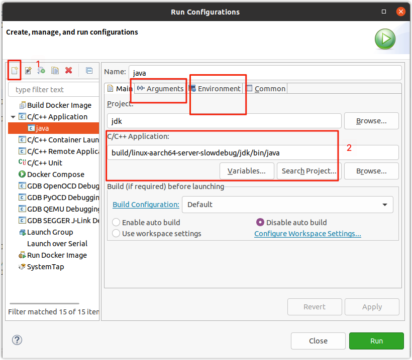

# IDE调试配置教程

## 1. IDE列表 
    1. Eclipse
    2. JetBrains Clion
    3. NetBeans

### 1.1 Eclipse

#### 简介: 
Eclipse是著名的跨平台的自由集成开发环境（IDE）。最初主要用来Java语言开发，但是目前亦有人通过插件使其作为其他计算机语言比如C++和Python的开发工具。

所以安装eclipse时请务必安装好jdk~

接下来根据对应的平台选择对应的版本。这里不再赘述
> 下载地址: [点此进入](https://www.eclipse.org/downloads/packages/)

1. 安装完毕后开启eclipse， 选择import 你编译好的openjdk

2. 选择c/c++项目 选择导入即可。

3. 接下来配置运行命令

创建调试选项配置，然后将应用程序选择为你自己编译好的路径。在 `argument` 标签中加入你要执行的主类 (可以是任意带main方法的类)

在 `environment` 标签中配置对应的classpath路径。是kv结构的。主要让ide顺利的找到你的主类 

如上所述配置完成之后即可享受你的debug之旅~

### 1.2 JetBrains Clion

#### 简介

Clion 是一款专为开发C及C++所设计的跨平台IDE。它是以IntelliJ为基础设计的，包含了许多智能功能来提高开发人员的生产力。CLion帮助开发人员使用智能编辑器来提高代码质量、自动代码重构并且深度整合CMake编译系统，从而提高开发人员的工作效率。
> 下载地址: [点此进入](https://www.jetbrains.com/clion/)
Clion 是一款专为开发C及C++所设计的跨平台IDE。它是以IntelliJ为基础设计的，包含了许多智能功能来提高开发人员的生产力。CLion帮助开发人员使用智能编辑器来提高代码质量、自动代码重构并且深度整合CMake编译系统，从而提高开发人员的工作效率。

1. 导入openjdk

2. 索引完成之后生成CMakeLists.txt

